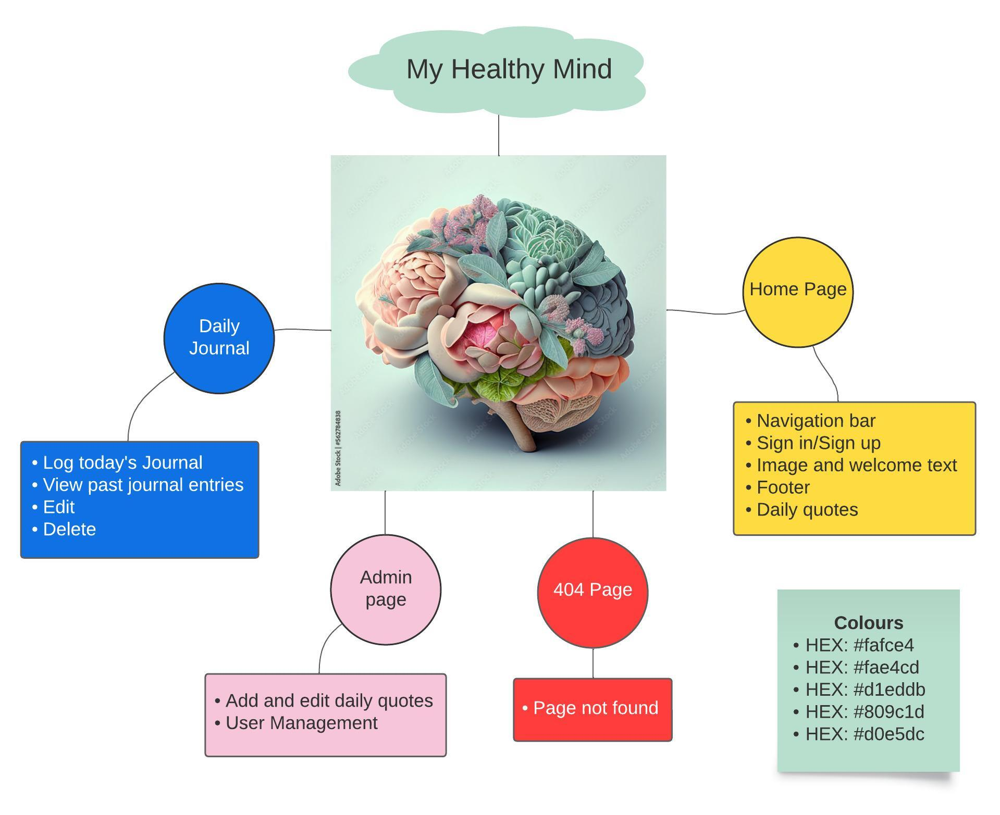
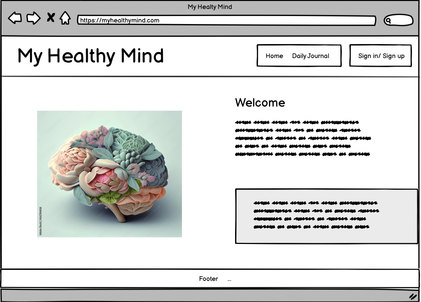
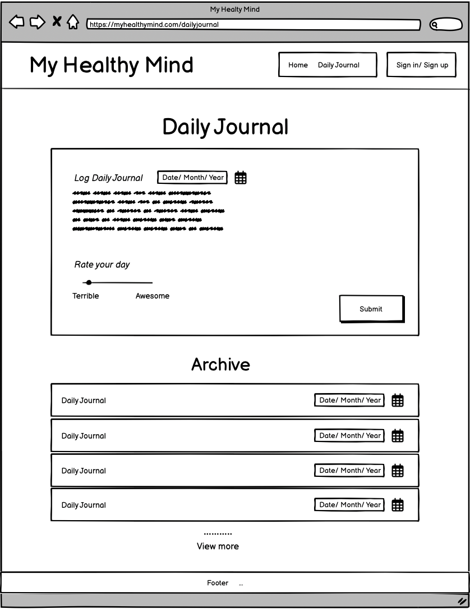

# My Healthy Mind

## Description

### Who is the user?

### What is the purpose?

## UX and design

### Mind Map

### Wireframe

## Features

### Home Page with navigation

The Home Page offers visitors a welcoming text and an image capturing the purpose of the website. A navbar is displayed on the top of the page for easy navigation between the websites different pages. A footer is displayed on the bottom of the page.

### User autentication

To be able to log a Daily Journal with the supporting features, the visitor of the webiste must first sign up. They can then sign in and sign out at any time. This feature ensures that no other than the logged in user can create, view, edit and delete journals.

### Daily Quotes

A daily quote is displayed on the homepage to inspire and motivate both users and visitors, with new quotes added and updated regularly by the admin.

### Admin site

### Log Daily journal

This features allows the users to record their daily thoughts, emotions and happenings of the day. They can also rate their day on a scale from Terrible to Amazing.

### View previously logged journal entries

This feature lets the user view their past journal entries as a list, in a convenient way. This allows the user to look back and reflect on previos days thoughts and feelings.

### Edit previously logged journal entries

On each logged journal entry there is an edit button that lets the user edit the logged journal entry. This enables the user to make changes or correct mistakes.

### Delete previously logged journal entries

On each logged journal there is a delete button that allows the user to delete journal entries that they no longer wish to keep.
It gives the user the flexibility to delete entries that no longer serve a purpose or that they would rather not have on record.

## User Stories

## Entity-relationship Diagram

## Testing

### Performance

### Validator testing

### Functional testing

### Unfixed bugs

## Technologies
Django, gunicorn(server heroku), 
supporting libraries - dj_database_url, psycopg2
cloudinary
### Languages

### Frameworks and libraries

### Databases
PostgreSQL

## Deployment

### Version control

The git commands below were used throughout development to push code to the remote repository in GitHub:

git add . - This command was used to add a change in the working directory to the staging area.
git commit -m "message" -This command was used to save changes to the local repository. A brief description of what has changed and when.
git push - This command was used to push all commits to the remote repository on GitHub.
Deploy to Heroku

### Deploy to Heroku

The steps below were followed to deploy the app to Heroku:

Open the Heroku website and select "New" to create a new app.
After choosing a name for the new app, and selecting the correct region, click on "Create app".
Navigate to "Settings" and go to the Config Vars section. Add a Config Var with the keyword "PORT" and value of "8000".

Navigate to the top menu and go to "Deploy". Scroll down and set the Deployment Method to "Github". Once Github is selected, locate your repository and link it to Heroku.
Scroll down to Manual Deploy, ensure that the "main" branch is selected, and click "Deploy Branch".
You will see the text "Your app was successfully deployed.". Click the button "View" to open the link to your deployed app.

### Clone the Repository from GitHub

The steps below were followed to clone the repository locally:

Navigate to the main page of the GitHub Repository you want to clone.
Above the list of files, click on the drop-down button "<>Code".
Copy the repository link.
Open Terminal, type git clone followed by the copied URL, and press enter to create your local clone.

## Credits
