# My Healthy Mind

## Description

My Healthy Mind is an online journaling platform where users can log their daily thoughts, reflect on their experiences and work towards a happier healthier self.
The core functionality of My Healthy Mind revolves around journaling. In the journal, the user can write down all their thoughts and feelings. Beyond that, they can rate their day on a spectrum ranging from "Awful" to "Amazing, and they can also upload a photo to capture their day.
When users visit the website's home page, they are greeted with inspirational quotes that updates every time the website is reloaded. This feature aims to fill the user's experience with positivity and motivation.

### Who is the user?

My Healthy Mind is aimed at people who want to prioritize their mental well-being and that seek a platform for daily journaling to exprees their thoughts and feelings.

### What is the purpose?

The purpose of My Healthy Mind is to provide users with an online space to log their daily journal, and to be able to reflect on past journals. With a user-friendly interface and features like daily rating and uploading photos, the goal is to to promote mental wellness and a positive mindset.

## UX and design

### Mind Map

The Mind Map was made using Lucidchart.

### Wireframe

The Wireframe was made using Balsamiq Wireframes.

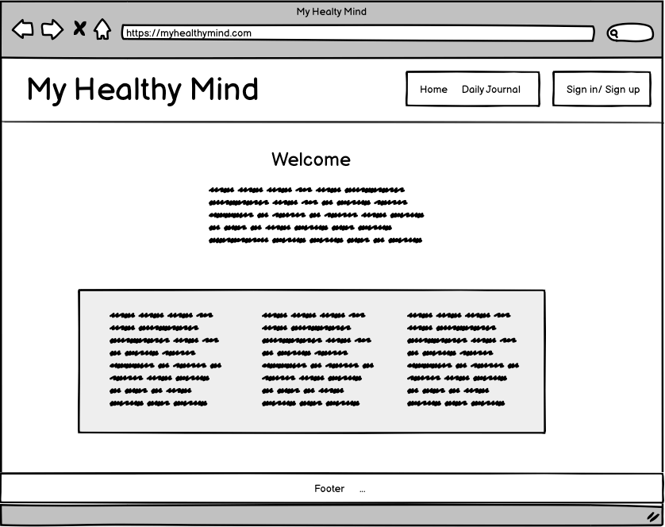
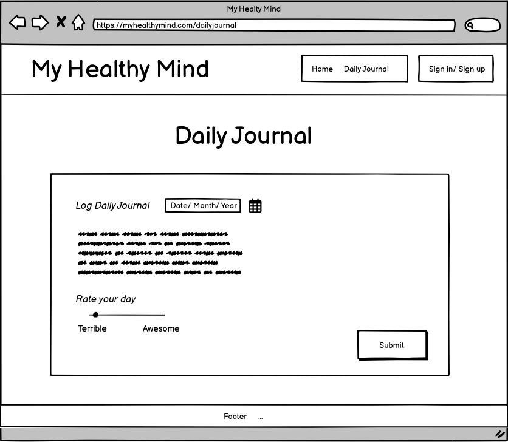

## Features

### Home Page with navigation

The Home Page offers visitors a welcoming text and an image capturing the purpose of the website. A navbar is displayed on the top of the page for easy navigation between the websites different pages. The navbar items differ depending on if the user is signed in or not. A footer is displayed on the bottom of the page with links to social media platforms.

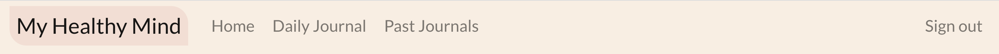

### User autentication

To be able to log a Daily Journal with the supporting features, the visitor of the webiste must first sign up. They can then sign in and sign out at any time. This feature of user authentication ensures secure access to the website's features. Only registered users can sign in, log a journal, view past journals, edit and delete their journals.
When the user has either signed up, signed in or signed out, a success message will appear letting the user know the action was successfull.

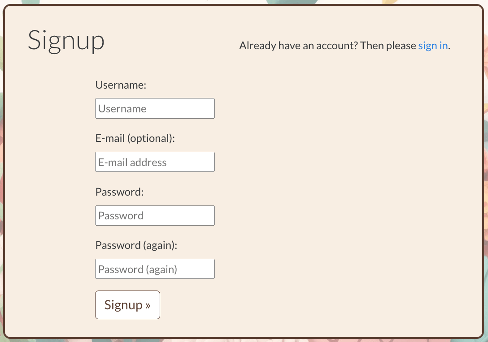
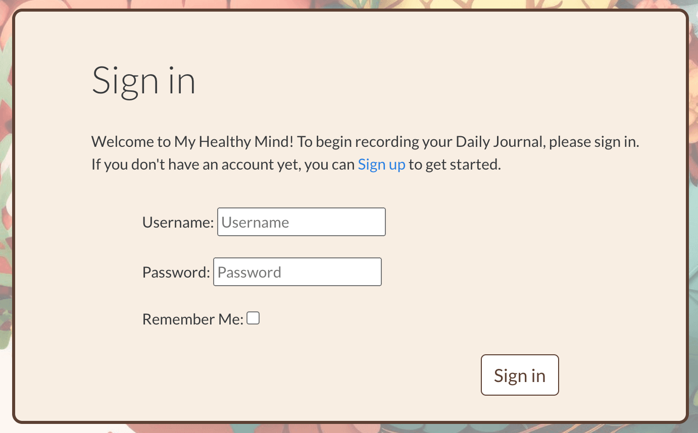
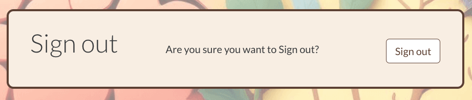

### Features and Daily Quotes Cards

On the home page two cards are displayed, brielfy explaing the two features "Daily Journal" and Past Journals" with two corresponding buttons. If the user (or a visitor on the page) is not signed in, the buttons are changed to link to the sign up page, and displays the text "Sign in to Journal" and "Sign in to view Past Journals" respectively.
A daily quote is displayed on the home page, in between the two features cards, to inspire and motivate both users and visitors, with new quotes added and updated regularly by the admin. This feature offers both users and visitors a positive and motivational experience while on the website.

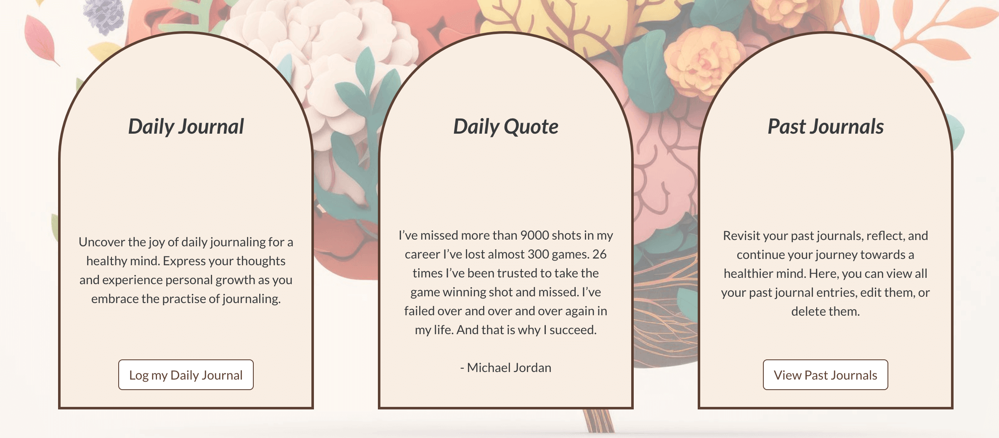

### Log Daily Journal

This features allows the users to record their daily thoughts, emotions and happenings of the day. With the additional features of rating their day and upload a photo, the user can create a more personalised and memorable journal.
A success message is displayed when the journal has been successfully submitted.

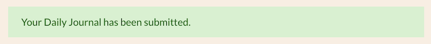

### View Past Journal entries

This feature lets the user view their past journal entries as a list, in a convenient way. When the user clicks on the list item for the journal they want to view, it expands to view the journal content. To collapse the opened jounal the user can click on the list item again.
The ability to view past journals allows the user to look back and reflect on previous days thoughts and feelings.

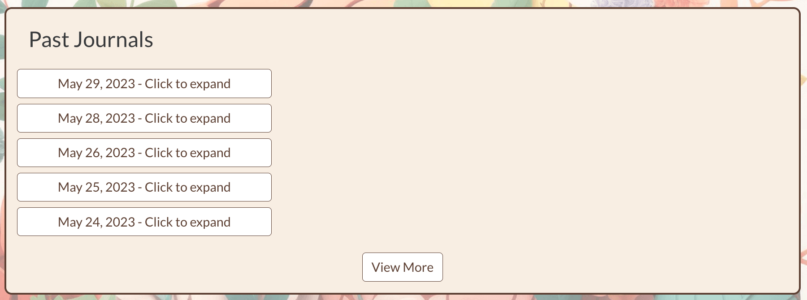
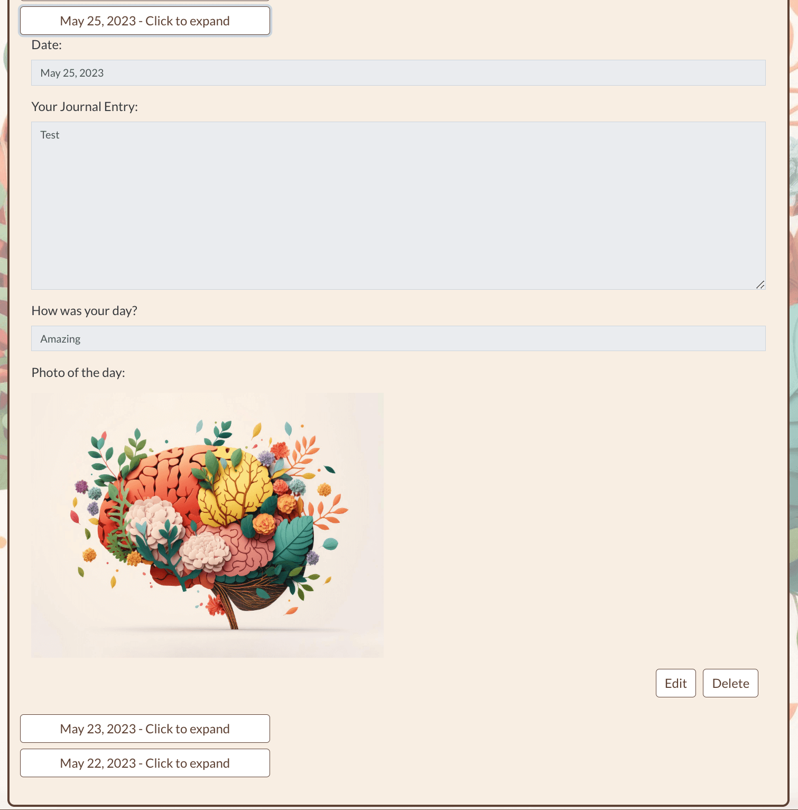

### Delete Past Journal entries

On each journal there is a delete button that allows the user to delete journal entries that they no longer wish to keep.
It gives the user the flexibility to delete journals that no longer serve a purpose or that they would rather not have on record.
The user is taken to a confirmation page where they have to confirm they want to delete the journal, or they have the option to cancel the initiated deletion.
A success message is displayed when the journal has been deleted sucessfully.

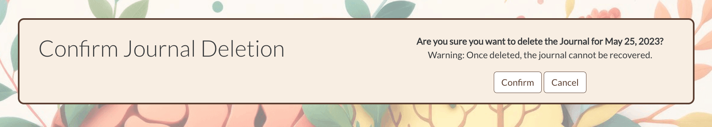

### Edit Past Journal entries

On each journal entry there is an edit button that lets the user edit the Journal entry. This gives the user the ability to make changes or correct mistakes. The user can either save the updated form or cancel the ongoing edit.
A success message is displayed when the journal has been updated sucessfully.

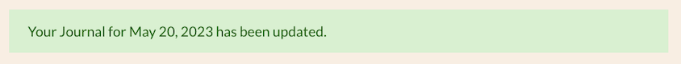

### Error pages

I've included three error pages for the webiste.
Here is the 404 error page included below to illustrate the design presented to the user when they are redirected to an error page.
The layout remains consistent across all error pages, with the appropriate error message displayed for each specific error.

- 404: Indicates that the requested resource could not be found on the server.
- 403: Signifies that access to the requested resource is forbidden or restricted.
- 500: Represents an internal server error, indicating that something went wrong on the server's side while processing the request.

### Admin page

While on the Admin page the administrator can manage and maintain features on the website. They can create, edit or delete Daily Quotes and handle management regarding the Journal features, and users.

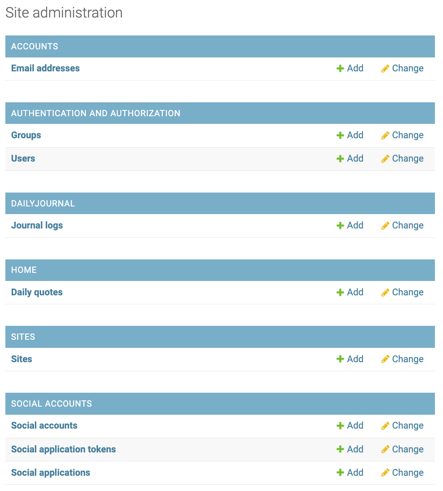

## User Stories

I created user stories in Github and assigned them to 5 different milestones (Daily Journal, User Experience Improvements, User Authentication, Home Page and Development) and applied appropriate labels to each one. I organized and prioritized the development tasks within the My Healthy Mind project.

## Entity-relationship Diagram

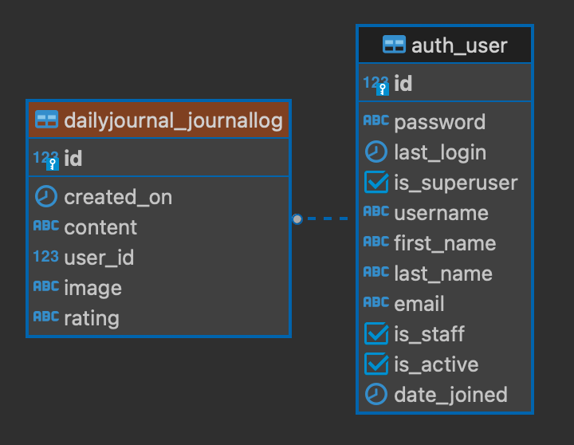

## Testing

### Performance

### Validator testing

### Functional testing

### Unfixed bugs

## Technologies

Django, gunicorn(server heroku),
supporting libraries - dj_database_url, psycopg2
cloudinary

### Languages

### Frameworks and libraries

### Databases

PostgreSQL

## Deployment

### Version control

The git commands below were used throughout development to push code to the remote repository in GitHub:

git add . - This command was used to add a change in the working directory to the staging area.
git commit -m "message" -This command was used to save changes to the local repository. A brief description of what has changed and when.
git push - This command was used to push all commits to the remote repository on GitHub.
Deploy to Heroku

### Deploy to Heroku

The steps below were followed to deploy the app to Heroku:

Open the Heroku website and select "New" to create a new app.
After choosing a name for the new app, and selecting the correct region, click on "Create app".
Navigate to "Settings" and go to the Config Vars section.
Add the neccessary Config Vars.
(Making sure to remove the DISABLE_COLLECTSTATIC, 1 and DEBUG, True before deployment.)

Navigate to the top menu and go to "Deploy". Scroll down and set the Deployment Method to "Github". Once Github is selected, locate your repository and link it to Heroku.
Scroll down to Manual Deploy, ensure that the "main" branch is selected, and click "Deploy Branch".
You will see the text "Your app was successfully deployed.". Click the button "View" to open the link to your deployed app.

### Clone the Repository from GitHub

The steps below were followed to clone the repository locally:

Navigate to the main page of the GitHub Repository you want to clone.
Above the list of files, click on the drop-down button "<>Code".
Copy the repository link.
Open Terminal, type git clone followed by the copied URL, and press enter to create your local clone.

## Credits

- Code Institute LMS
- I Think Therefore I Blog - LMS
- The Slack Community
- My mentor Daisy McGirr
- Bootstrap documentation
- Django documentation
- uxwing.com - for social media icons
- https://css-tricks.com/couple-takes-sticky-footer/ - How to create a sticky footer
